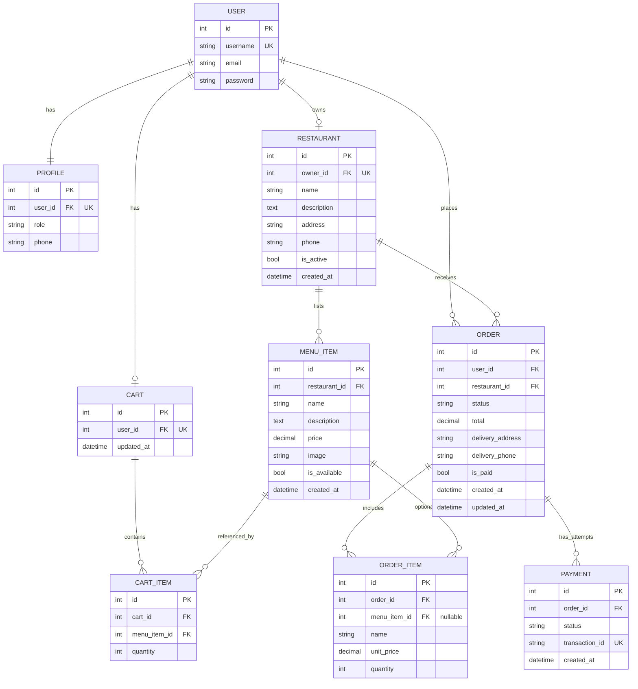

# Entity–Relationship (ER) Diagram

## CampusEats — Online Food Ordering System

This document describes the logical data model implemented in the Django application. Cardinalities match the ORM relationships.

---

## 1. Diagram (Mermaid)

Render this section in any **Mermaid-compatible** viewer (e.g. GitHub, VS Code preview with Mermaid extension, or https://mermaid.live).

---

## 2. Relationship Summary

| Relationship | Type | Description |
|--------------|------|-------------|
| User — Profile | 1 : 1 | Every registered user has one profile (role, phone). |
| User — Restaurant | 1 : 0..1 | An outlet manager owns at most one outlet. |
| User — Cart | 1 : 0..1 | A customer gets a cart when first needed (lazy creation). |
| User — Order | 1 : N | A customer may place many orders. |
| Restaurant — MenuItem | 1 : N | Each item belongs to one outlet. |
| Restaurant — Order | 1 : N | Each order targets one outlet. |
| Cart — CartItem | 1 : N | Cart lines; unique (cart, menu_item) in application. |
| Order — OrderItem | 1 : N | Snapshot lines; menu_item FK optional for history if item deleted. |
| Order — Payment | 1 : N | Multiple rows allowed (e.g. failed then success attempts). |

---

## 3. Notes

- **USER** maps to Django’s `auth_user` table (simplified attributes in the diagram).
- **ORDER.status** stores a code (e.g. `pending_payment`, `placed`); labels are defined in application code.
- **ORDER_ITEM** stores **name** and **unit_price** as snapshots at order time so historical totals stay correct if menu prices change later.

---

*End of ER Diagram document*
