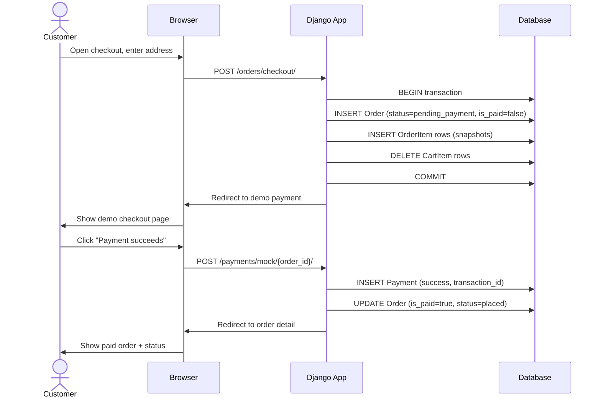
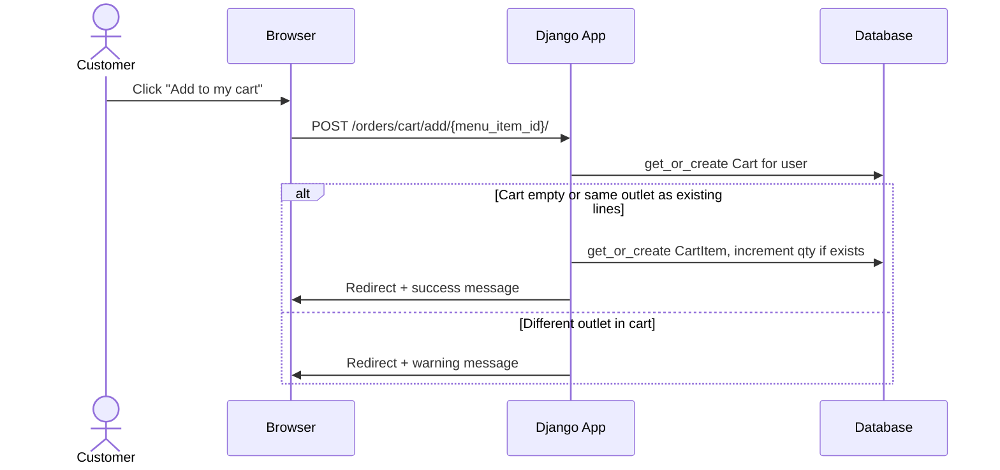
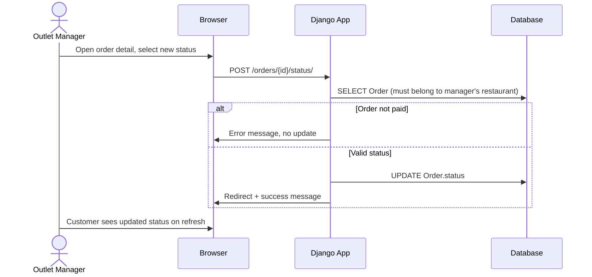
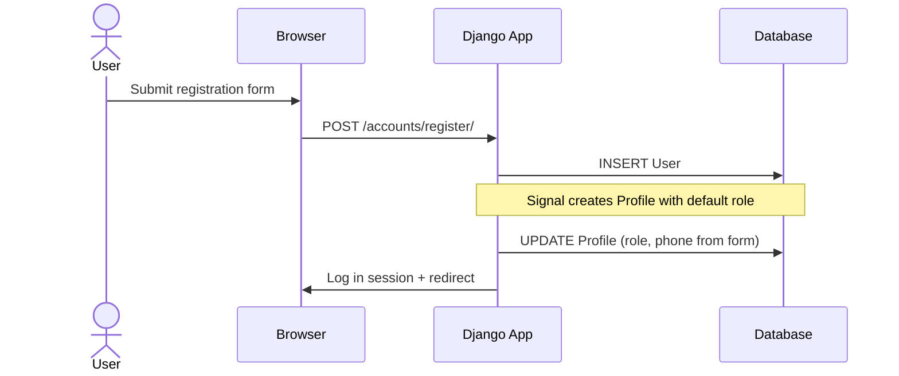

# Sequence Diagrams

## CampusEats — Online Food Ordering System

Diagrams use **Mermaid** syntax. Open in a Mermaid-compatible viewer or paste into https://mermaid.live.

---

## 1. Customer — Place order and complete demo payment

Shows the main flow from checkout through unpaid order to successful demo payment.

---

## 2. Customer — Add item to cart (same outlet)

---

## 3. Outlet manager — Update order status after payment

---

## 4. Registration and profile creation (conceptual)

---

## 5. Diagram index

| # | Scenario |
|---|----------|
| 1 | Checkout → create order → demo payment success |
| 2 | Add to cart with single-outlet rule |
| 3 | Outlet manager updates tracking status |
| 4 | Register user and persist role on profile |

---

*End of Sequence Diagram document*
